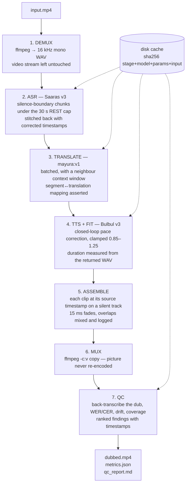

# Sarvam Video Dubbing Pipeline

Batch video dubbing (English → Hindi by default) built entirely on Sarvam AI's APIs, with
**closed-loop duration fitting** so the dub is generated at the right tempo rather than
time-stretched into chipmunk artefacts afterwards.

**Status: all 7 milestones complete.** `input.mp4` → `dubbed.mp4` + `metrics.json` +
`qc_report.md`, in one command, resumable stage by stage, with every API response cached.

> **Every number in this repo comes from an actual run.** Nothing is estimated,
> interpolated, or illustrative. Unmeasured fields serialise as `"not yet measured"`, never
> as `0`. Where a result is weak or inside the noise, this README says so — see
> [Limitations](#limitations), which is the most important section here.

---

## Architecture



Every stage writes its artefacts to disk, so any stage can be re-run on its own
(`--stage tts`) without repeating the ones before it. Every Sarvam call goes through one
client (`src/sarvam_client.py`) that owns auth, retries, backoff, rate-limit handling,
caching, latency measurement, and cost accounting.

---

## Headline results

Measured on `samples/test_clip.mp4` — 36.107 s, 4 segments, English → Hindi.

### Throughput and cost

| | Cold cache (first run) | Warm cache (re-run) |
| --- | --- | --- |
| Wall clock | 18.255 s | **1.086 s** |
| Realtime factor | 0.506× | **0.030×** |
| Network calls | 15 | **0** |
| Cost | ₹2.1610 | **₹0.0000** |
| Cache hits / misses | 0 / 15 | **15 / 0** |

A second run over the same input with the same parameters costs ₹0 and opens no sockets —
`--dry-run` enforces that by turning any cache miss into a hard failure.

**Per-stage latency, cold run (seconds):**

| demux | asr | translate | tts | assemble | mux | qc | total |
| --- | --- | --- | --- | --- | --- | --- | --- |
| 0.133 | 1.089 | 0.397 | **14.222** | 0.076 | 0.436 | 1.857 | 18.255 |

Synthesis dominates at 78% of wall clock — 8 calls, because the fit loop spends a second
attempt on every segment. That is the price of closing the loop, and it is why the loop is
capped at 3 attempts.

### Output quality (M6 QC harness, scoring the pipeline's own output)

| Metric | Measured |
| --- | --- |
| Corpus WER | 0.2381 |
| Corpus CER | 0.2135 |
| Edit operations | 10 substitutions, **0 deletions, 0 insertions** |
| Segments scored | 4 of 4 |
| Coverage | PASS at all 5 stage hops |
| Post-mux integrity checks | 7 of 7 passed |

Zero deletions and zero insertions rules out a dropped or duplicated segment. All 10
substitutions were inspected by hand:

| Kind | Count | Example |
| --- | --- | --- |
| Latin-script loanword transcribed in Devanagari | 8 | `card` → `कार्ड` |
| Orthographic variant of the same sound | 1 | `हाँ` → `हां` |
| **Genuine content error** | **1** | `चुन लीजिए` (pick) → `सुन लीजिए` (listen) |

So **0.2381 is an upper bound; the genuine content error rate is 1 word in 42 (2.4%)**. The
8 script mismatches are structural: `mayura:v1` keeps English loanwords in Latin script
(the right call for a code-mixed register), while Saaras transcribes them in Devanagari. The
QC report measures and prints that count rather than arguing it away.

**Segment 3 round-tripped word for word identical** through translate → synthesise → fit →
place → remux → re-transcribe. That is the strongest single piece of evidence that the
timeline arithmetic is correct.

### Second sample: `samples/jfk_10s_16k_mono.wav` (committed, so you can reproduce it)

`samples/test_clip.mp4` above is **not committed** (it is a third-party clip kept out of the
repo for licence reasons), so the numbers you can reproduce from a clean clone come from the
10-second public-domain JFK extract that *is* committed:

```bash
python -m src.pipeline --input samples/jfk_10s_16k_mono.wav --output output/jfk_dubbed.m4a
```

| Metric | Measured |
| --- | --- |
| Wall clock (cold) | 10.316 s for 10.0 s of audio — realtime factor 1.032× |
| Cost (cold) | ₹0.9167 over 5 network calls |
| WER / CER | **0.0556 / 0.0761** — 1 substitution in 18 words |
| The one substitution | `Solomon` → `सोलोमन`, i.e. the script mismatch again |
| Duration drift | 28.3% → **15.6%** with fitting (a 44.9% reduction, n=1) |
| Window fill | 84% — this clip is mostly speech, so the fit loop has real work to do |

This is the better demonstration of the duration-fit loop: because a 10-second clip of
continuous oratory has almost no pause padding, the window is a genuine target and the loop
halves the drift. It is a single segment, so it is an illustration, not a statistic.

It also exposes a limitation the card-trick clip hid — see limitation 9 below: Saaras
transcribed JFK's "the same solemn oath our forebears prescribed" as "the same Solomon are
forebears prescribed", the pipeline faithfully translated and dubbed that error, and
**the QC harness scored it 0.0556 because it compares the dub against the translation, not
against the source.**

---

## The core engineering problem: translated speech is a different length

Hindi carries roughly 1.5× the syllables of the English source (measured in M3). Synthesise
a translation at neutral pace and it overruns its window; the dub walks out of sync within
seconds. The naive fix — time-stretching afterwards — is what produces the artefacts of
cheap dubbing.

This pipeline instead generates speech at the right tempo, using Bulbul's native `pace`, and
closes the loop by measuring what actually came back:

```
target  = segment.end - segment.start
attempt 1 is ALWAYS pace=1.0          ← this is also the unfitted baseline
ratio   = measured_duration / target
if 0.95 <= ratio <= 1.05: converged
else pace ← clamp(pace * ratio, 0.85, 1.25)
at most 3 attempts; stop once the pace stops moving
```

Four decisions that make it trustworthy rather than plausible:

1. **Attempt 1 *is* the baseline.** The before/after comparison reuses it instead of
   re-synthesising at pace 1.0, so both columns cover identical segments and identical text,
   and the comparison costs zero extra credits.
2. **Duration is measured from the returned audio**, from the WAV's own frame count — never
   from a field the API reports.
3. **Silence is trimmed before measuring.** Bulbul pads its output and the padding does not
   scale with pace; measured at up to 5.7% of a clip, which is larger than the ±5%
   convergence band and could decide a segment's verdict on its own.
4. **The clamp is 0.85–1.25, not the API's 0.5–2.0.** Past roughly ±25% speech stops
   sounding human. The measured pace sweep supports the same limit independently: above 1.25
   the duration response nearly saturates (elasticity falls from about −1.5 to −0.2), so the
   extra range buys almost nothing anyway.

`pace` semantics were confirmed by real calls, not by reading: **higher pace = faster =
shorter audio**, so `pace *= ratio` has the correct sign. Getting that backwards would have
driven every segment away from its target.

### Before/after — and why this clip cannot prove much

| Mean absolute drift | Without fit | With fit | Reduction |
| --- | --- | --- | --- |
| Cold run | 66.54% | 58.91% | 11.47% |
| Warm run | 62.62% | 60.81% | 2.88% |

**These two runs measure the same four segments with the same text, and they disagree.** The
cause was tracked down rather than averaged away, and it is the most interesting finding in
the project — see below. On this clip, with n=4 and 21.5% synthesis variance, **the
duration-fit improvement is inside the noise and should not be quoted as a result.** The
loop's behaviour is nonetheless verifiable directly: 51 unit tests in `tests/test_tts.py`
drive convergence, clamping, non-convergence, and best-attempt selection against a synthetic
synthesiser whose response to `pace` the test controls.

### Finding: Bulbul v3 is not duration-deterministic

Three calls with a byte-identical request body (same text, `pace=1.0`, same speaker and
sample rate), each with a fresh cache so every call really hit the network:

| Call | Trimmed duration |
| --- | --- |
| 1 | 6.580 s |
| 2 | 5.260 s |
| 3 | 6.540 s |

**Spread 1.320 s = 21.55% of the mean (σ = 0.751 s).** Reproduce with
`make variance-probe`; raw data in `output/tts_variance_probe.json`.

Consequences:

- 21.55% run-to-run variance is **more than 4× the ±5% convergence band**, so a pace computed
  from one measurement cannot be assumed to hold on the next call. Caching a pace per phrase
  and reusing it — an obvious-looking optimisation — would be unsound.
- **The pipeline is unaffected, because it ships the exact audio it measured.** The loop
  places the same WAV it measured and never re-requests after measuring. Measure-then-ship is
  correct here; measure-then-re-request would not be.
- Duration statistics over a handful of segments carry this variance, which is exactly why
  the drift table above is reported as inconclusive.

---

## Setup

Verified from a fresh `git clone` on Windows 11 with Python 3.14 (see
[Verified from a clean clone](#verified-from-a-clean-clone)).

**Prerequisites:** Python 3.11+, `ffmpeg` and `ffprobe` on `PATH`, and a Sarvam API key from
[dashboard.sarvam.ai](https://dashboard.sarvam.ai).

```bash
git clone https://github.com/Tharun0127/ai-video-dubbing.git
cd ai-video-dubbing

python -m venv .venv
.venv/Scripts/python.exe -m pip install -r requirements.txt   # Windows
# source .venv/bin/activate && pip install -r requirements.txt  # macOS/Linux

cp .env.example .env        # then put your bare key in it: SARVAM_API_KEY=sk_xxx
python -m pytest            # 339 tests, no network access required
```

Dub a clip end to end:

```bash
python -m src.pipeline --input samples/test_clip.mp4 --output output/dubbed.mp4 \
    --source-lang en-IN --target-lang hi-IN
```

Outputs land in `output/`: `dubbed.mp4`, `dubbed_audio.wav`, `metrics.json`, `qc_report.md`,
plus a JSON report per stage.

### CLI

```
--input PATH              source video or audio
--output PATH             where to write the dubbed video   (default output/dubbed.mp4)
--source-lang / --target-lang    BCP-47 codes               (default en-IN → hi-IN)
--no-fit                  disable duration fitting, for the before/after comparison
--max-segments N          cap segments during development, to save credits
--dry-run                 run entirely from cache; fail loudly on any cache miss
--stage NAME              run one stage and stop (demux|asr|translate|tts|assemble|mux|qc)
--verbose                 DEBUG logging, including API request/response bodies
```

Plus tuning flags for every stage (`--silence-threshold-db`, `--translate-mode`,
`--tts-speaker`, `--pace-min/--pace-max`, `--fade-ms`, `--qc-drift-threshold-pct`, …).
`python -m src.pipeline --help` lists them all with their defaults.

`make help` lists the shortcuts (`make dub`, `make qc`, `make dry-run`, `make test`).

---

## Limitations

Written honestly, because the failure modes are more informative than the successes.

**1. Segment windows include pauses, so the fit loop aims at the wrong target.** This is the
biggest real defect. M2 segments *tile* the timeline, so each window covers a phrase **plus
the pause that follows it**. On the test clip — a card trick with long theatrical pauses —
only **40.3% of the timeline is speech**. The loop is therefore asked to stretch a 1.8 s line
to fill a 5.5 s window, clamps at 0.85, and stops. All 4 segments end up "clamped" and none
"converged", which reads like a failing loop but is the loop correctly refusing to produce
unlistenable speech. Sync is preserved anyway, because each line still starts at its source
timestamp and the remainder is silence — which is what the pause was. **The fix** is to
derive the target from the speech-active span inside each window (the silence spans are
already detected and already in `asr_report.json`) rather than from the full tiled window.
That changes the M2 contract M3 and M4 were measured against, so it belongs in its own
before/after, not folded in silently here.

**2. The sample is tiny.** 4 segments, 36 seconds, one clip, one speaker, one language pair.
p95 is reported because SPEC.md asks for it, and flagged as `small_sample: true` in
`metrics.json` because nobody should quote it as robust.

**3. The duration-fit improvement is inside the noise.** See the finding above. Proving the
loop's value needs a clip whose segments actually overrun (a dense, fast-talking lecture),
plus enough segments to average out 21% synthesis variance.

**4. WER is inflated by a script mismatch it cannot avoid.** 8 of 42 reference words are
Latin-script loanwords that Saaras transcribes in Devanagari. The count is measured and
printed, but no transliteration-aware scorer is implemented.

**5. v1 replaces the audio track entirely.** Background music and effects are lost with the
original speech. Source separation (Demucs) is a documented non-goal for v1.

**6. Sync is per segment, not per word.** The synchronous `/speech-to-text` endpoint returns
one timestamp span per chunk, so segment boundaries come from local silence detection rather
than from the API. `stitch_chunk_transcripts` is already written and tested for the
multi-span case, so Batch API timestamps would drop in by changing one function.

**7. Single speaker, fixed voice.** Diarization and per-speaker voice assignment are v1
non-goals. Every line is spoken by `shubh`.

**8. Overlap handling is detection, not resolution.** Colliding clips are summed with
clamping and reported; nothing re-times them. On this clip 0 overlaps occurred, so the
mixing path is covered by unit tests rather than by a real run.

**9. QC cannot see ASR errors, by construction.** The harness scores the dub against the
*translation*, so it measures synthesis and assembly fidelity — not whether the transcript
was right in the first place. The JFK run proves the gap: Saaras heard "the same solemn oath
our forebears prescribed" as "the same Solomon are forebears prescribed", the pipeline
faithfully dubbed that, and QC returned a near-perfect 0.0556 WER. Catching it needs a
second reference — either a human transcript, or back-translating the dub to the source
language and scoring against the *source* text. That is the single most valuable next
addition to the harness.

**10. Stage outputs are not namespaced per input.** All stages read and write fixed
filenames under `output/`, so two different inputs share one working directory. The demux
stage now records `demux_provenance.json` and re-extracts when the WAV came from a different
input — a guard added after this bug was caught in practice (see the commit after M7) — but
running `--stage tts` directly against a stale `segments.json` from another input would
still produce nonsense. A per-input output directory is the proper fix.

---

## How it is built

```
src/
  config.py          typed config, validated language/model/mode matrices, published prices
  sarvam_client.py   THE http client: auth, retries, backoff, 429/5xx, cache, cost, latency
  cache.py           sha256(stage + model + params + input_hash) → disk
  audio.py           ffmpeg wrappers, silence detection, sample-accurate slicing, mixing
  metrics.py         stage timers, cost accounting, paired before/after drift statistics
  qc.py              back-transcription, WER/CER, coverage assertions, ranked findings
  pipeline.py        orchestration + CLI; always writes metrics.json, even on failure
  stages/            demux · asr · translate · tts · assemble · mux
tests/               339 tests, no sockets; real ffmpeg only on tiny generated fixtures
scripts/             milestone acceptance checks and API probes
docs/                api-notes.md (confirmed API shapes) + one results file per milestone
```

**Design rules this repo follows throughout:**

- No raw HTTP outside `sarvam_client.py`.
- No fabricated numbers. A metric that was not measured serialises as `"not yet measured"`.
- Every API response is cached to disk on first call and reused forever after.
- API behaviour is confirmed by a real call before it is relied on, and recorded in
  `docs/api-notes.md` with the date.
- Failures are loud: mismatched segment counts, non-contiguous timelines, silent audio, and
  failed post-mux checks all raise rather than log.

### Testing

339 tests, none of which open a socket. The Sarvam API is replaced by fixtures captured from
real responses (which double as API documentation). Real `ffmpeg` runs only against tiny
generated fixtures — a 1-second clip for the mux tests, because the claim that `-c:v copy`
leaves the picture untouched can only be demonstrated by a real remux.

```bash
python -m pytest              # everything
python -m pytest tests/test_tts.py -q     # the duration-fit loop in isolation
```

### Verified from a clean clone

`git clone` into an empty directory, fresh virtualenv, `pip install -r requirements.txt`,
`python -m pytest` — 339 passed in 11.3 s on Python 3.14.6, with no `.env` and no network access. The API key is only
needed to run the pipeline itself, never to run the tests.

---

## Milestone history

Each milestone is one commit with its measured outcome in the message, and one results file
with the raw numbers behind it.

| | Milestone | Result |
| --- | --- | --- |
| M1 | Skeleton, config, cache, metrics, Sarvam client, CLI | [results](docs/m1-results.md) — cache hit proven with a socket guard: 0.538 s → 0.0066 s, ₹0.083 → ₹0 |
| M2 | Demux + silence-boundary chunking + chunked-REST ASR | [results](docs/m2-results.md) — 2 chunks under the 30 s cap, seams contiguous to 1e-9 s |
| M3 | Per-segment translation with strict mapping assertions | [results](docs/m3-results.md) — 4→4 mapping, register comparison measured before choosing |
| M4 | TTS + closed-loop duration fitting | [results](docs/m4-results.md) — pace semantics confirmed by measurement; elasticity −1.18 to −1.57 inside the clamp |
| M5 | Assemble + mux | [results](docs/m5-results.md) — 7/7 post-mux checks, 1082 video frames unchanged, 0 overlaps |
| M6 | QC harness | [results](docs/m6-results.md) — WER 0.2381 / CER 0.2135, coverage PASS, 1 genuine content error found |
| M7 | Packaging, README, honest limitations | this file |

`docs/api-notes.md` is the accumulated record of every confirmed API shape, limit, and
price, with the date each was verified — including the Bulbul non-determinism finding, which
is not documented anywhere on docs.sarvam.ai.

---

## Non-goals for v1

Real-time/streaming, voice cloning, speaker diarization and multi-speaker voice assignment,
background music preservation via Demucs, lip-sync, and a web UI. All deliberately deferred
so v1 could ship complete.
